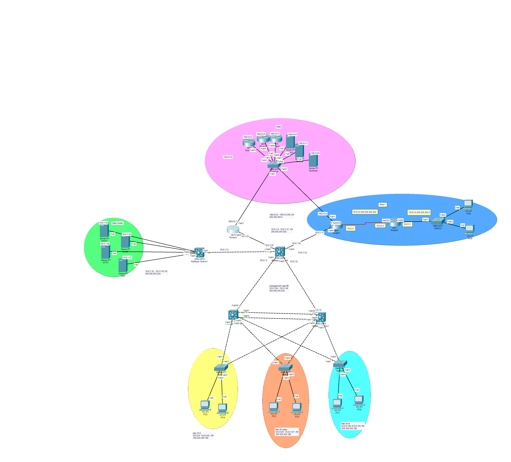
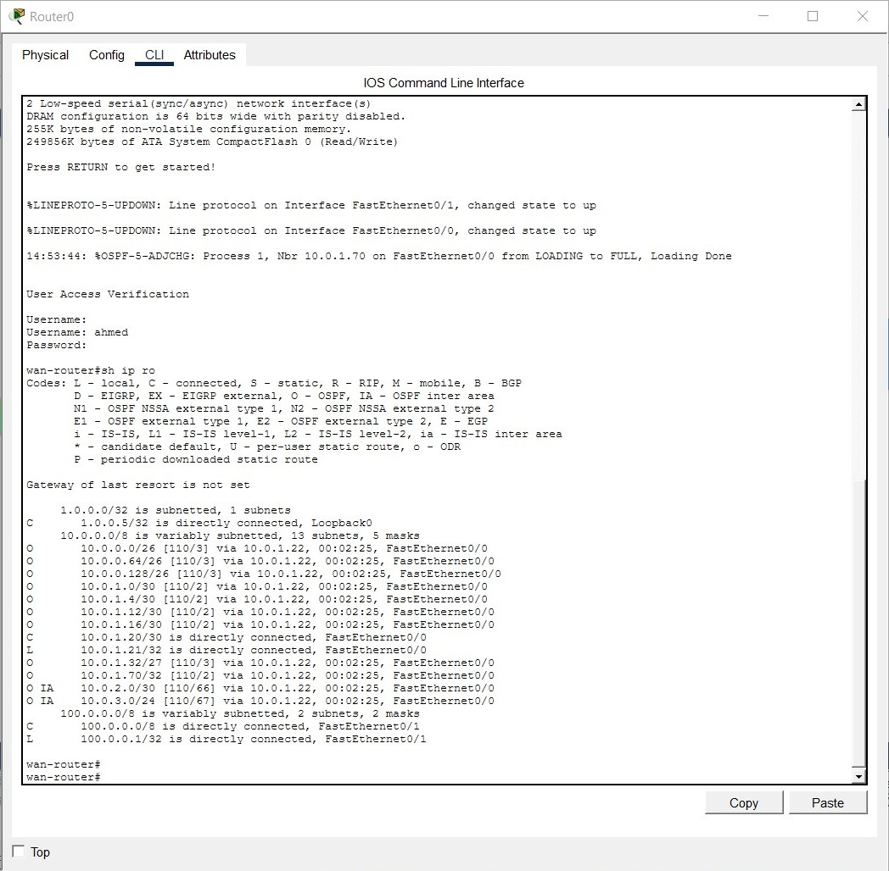
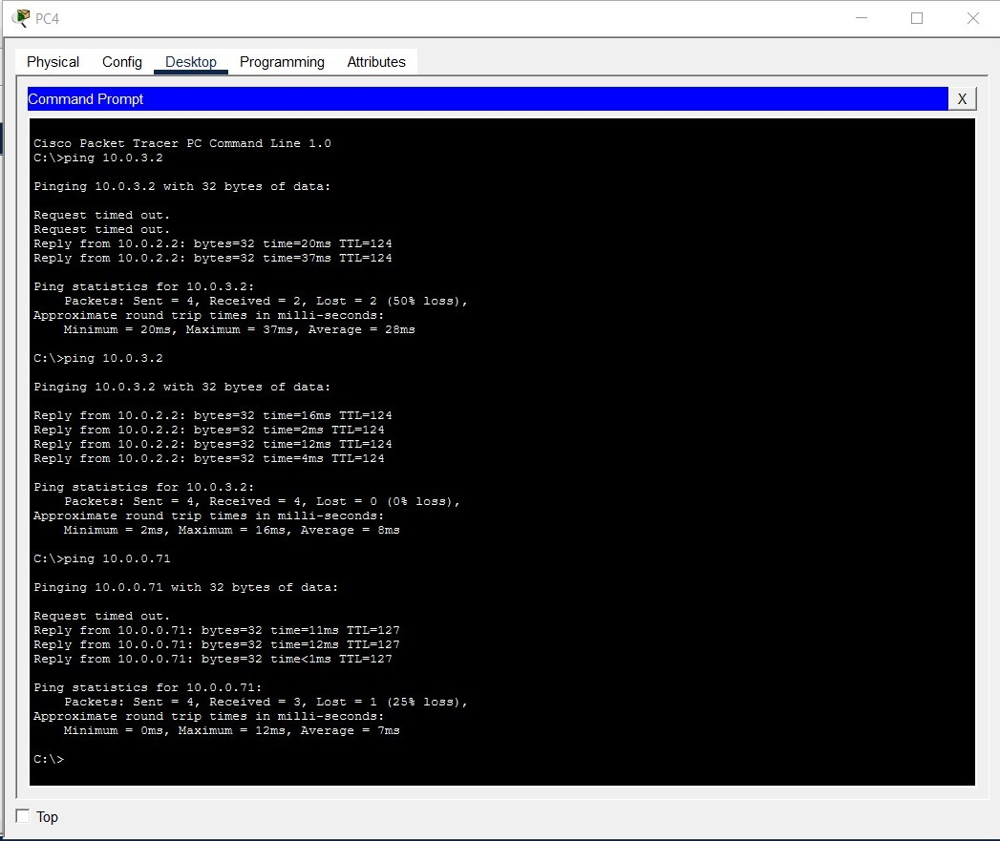

# Enterprise Network Design & Implementation using Cisco Packet Tracer

An advanced end-to-end enterprise network topology designed and simulated using **Cisco Packet Tracer**. This project demonstrates a scalable, redundant, and secure network infrastructure suitable for a medium-to-large organization with a dedicated Data Center, multiple VLANs, and remote branch connectivity.

---

## 🗺️ Network Topology

### 📐 Cisco Hierarchical Design Model
The network infrastructure is strictly designed following the **Cisco Three-Tier Hierarchical Model** to ensure scalability, high availability, and ease of management:
* **Core Layer:** Implemented high-speed Multilayer switches to handle bulk traffic routing between the Data Center, WAN branches, and the campus network with maximum throughput and zero packet filtering.
* **Distribution Layer:** Utilized Layer 3 switching to aggregate access switches, enforce routing policies, and perform Inter-VLAN routing and initial traffic control.
* **Access Layer:** Deployed Layer 2 switches providing direct network connectivity to end-user devices (PCs) across various departments with modern security practices.

---

## 🛠️ Technologies & Protocols Used

### 1. Switching & Local Area Network (LAN)
* **VLAN Segmentation:** Divided the local network into functional departments to reduce broadcast domains and enhance security.
    * **VLAN 10:** IT Department
    * **VLAN 20:** Sales Department
    * **VLAN 30:** HR Department
    * **VLAN 99:** Management VLAN (for secure device access)
    * **VLAN 100:** Data Center Department
* **Inter-VLAN Routing:** Configured using Multilayer Switches (Layer 3 Switches) for high-speed routing between departments.
* **Redundancy & Loop Prevention:** Implemented **Spanning Tree Protocol (STP / RSTP)** and **EtherChannel** (Link Aggregation) for high availability and load balancing between switches.

### 2. Routing & Wide Area Network (WAN)
* **Dynamic Routing (OSPF):** Configured **Multi-Area OSPF** to connect the main headquarters with the remote branch (**Area 1**).
* **WAN Connectivity:** Simulated serial link connections between edge routers using HDLC/PPP encapsulation.
* **Internet/WAN Simulation:** Created a simulated public internet zone containing simulated external services (e.g., Cisco, Facebook servers).

### 3. Network Services & Data Center (Centralized Services)
* **Secure Remote Access (SSHv2):** Configured **SSH** across all routers and switches instead of insecure Telnet. Implemented local authentication, strong RSA keys, and VTY line timeouts to ensure secure network administration.
* **DHCP Server:** Dynamic IP address allocation for all end devices across different VLANs using DHCP helpers.
* **DNS Server:** Domain name resolution for internal and external web services.
* **HTTP/Web Server:** Hosting corporate intranet and internet web pages.
* **Email Server:** Configured corporate email communication services for end-users.

---

## 📊 Verification & Testing (Screenshots)

To ensure the network is fully functional and optimized, the following verification tests were performed inside Packet Tracer:

### 1. Routing Table Verification
The output below confirms that the Core and Edge devices have successfully populated their routing tables with local, static, and **OSPF learned routes (`O`)**:

 

### 2. Connectivity & Ping Tests
End-to-end connectivity verification across different network zones and remote branches via successful ICMP Ping tests:

---
## 🔢 IP Addressing Plan

| Network Zone / VLAN | IP Subnet | Description |
| :--- | :--- | :--- |
| **VLAN 10 (IT)** | 10.0.0.0 /26 | Internal IT Department Hosts |
| **VLAN 20 (Sales)** | 10.0.0.64 /26 | Sales Department Hosts |
| **VLAN 30 (HR)** | 10.0.0.128 /26 | HR Department Hosts |
| **VLAN 99 (Mgmt)** | 10.0.1.64 /27 | Secure Switch/Router Management |
| **Data Center Zone** | 10.0.1.32 /27 | Centralized Infrastructure Servers |
| **WAN / Area 1** | 10.0.2.0 /30 & 10.0.3.0 /24 | Branch Connectivity Links |

---

## 🚀 How to Run the Project

1. Download and install **Cisco Packet Tracer** (Recommended Version: 8.x or higher).
2. Clone this repository or download the `.pkt` file directly
